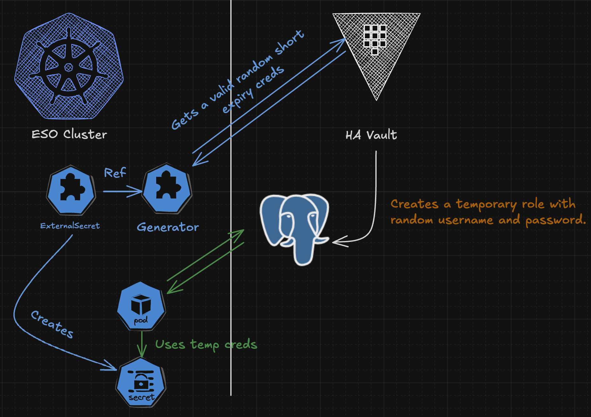

# Automatic Secret rotation with ESO

Gergely Brautigam 

https://github.com/Skarlso
https://gergelybrautigam.com 
https://github.com/external-secrets

QR code link to repository ->

---

# Agenda

- Why rotation is important
- External Secrets intro
- Rotation
- Demo
- ESO Reloader Demo
- Caveats
    - Downtime
    - Race conditions
- Closing words

---

# Why is it important to rotate secrets?

- the longer the token the longer the expouser and the chain of custody
- uber 2022 where a mobile device was compromised
- dependabot exploit of 2023
- cloudflare outage 2023. they rotated, however, due to human error some of the tokens
got exposed and they got inflitrated
- there are many many more...

---

# What is External Secrets Operator

<!--  -->

---

# Architecture

---

# Providers

- AWS
- GCP
- Vault
- Kubernetes
...

---

# SecretStore architecture

---

# SecretStore

---

# ExternalSecret

---

# What are generators

---

# Vault Dynamic Secret Generator

---

# Different Generator Types

- Azure Container Registry
- AWS Elastic Container Registry
- AWS STS Session Token
- Google Container Registry
- Quay
- Vault Dynamic Secret
- Password
- Webhook ( _any_ type )
- Github
- UUID

---

# What we are trying to achieve

---

# Demo

---

# Drawbacks

- No second secret rotation process ( where you switch over to a second secret instead of updating
the current one )
- Race condition can occur when rotation happens at the wrong time ( retry )

---

# Conclusion

Thank you for listening!
Gergely.
@Skarlso
