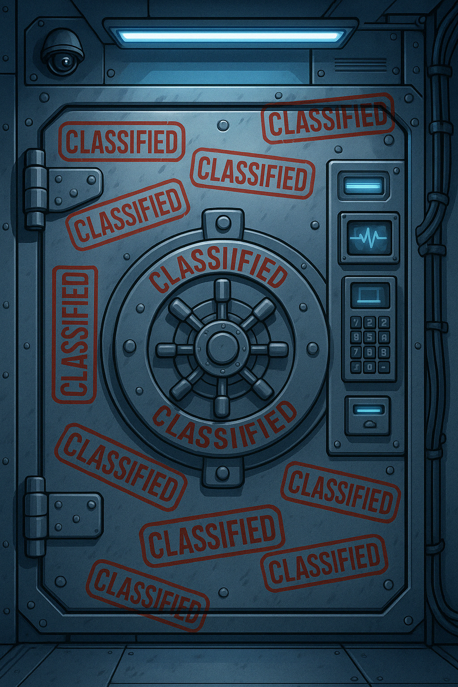
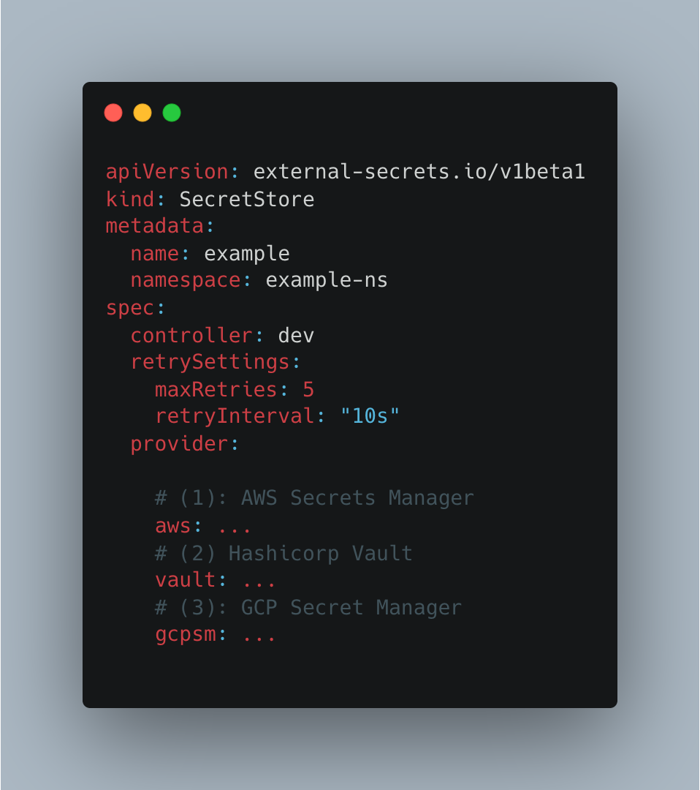
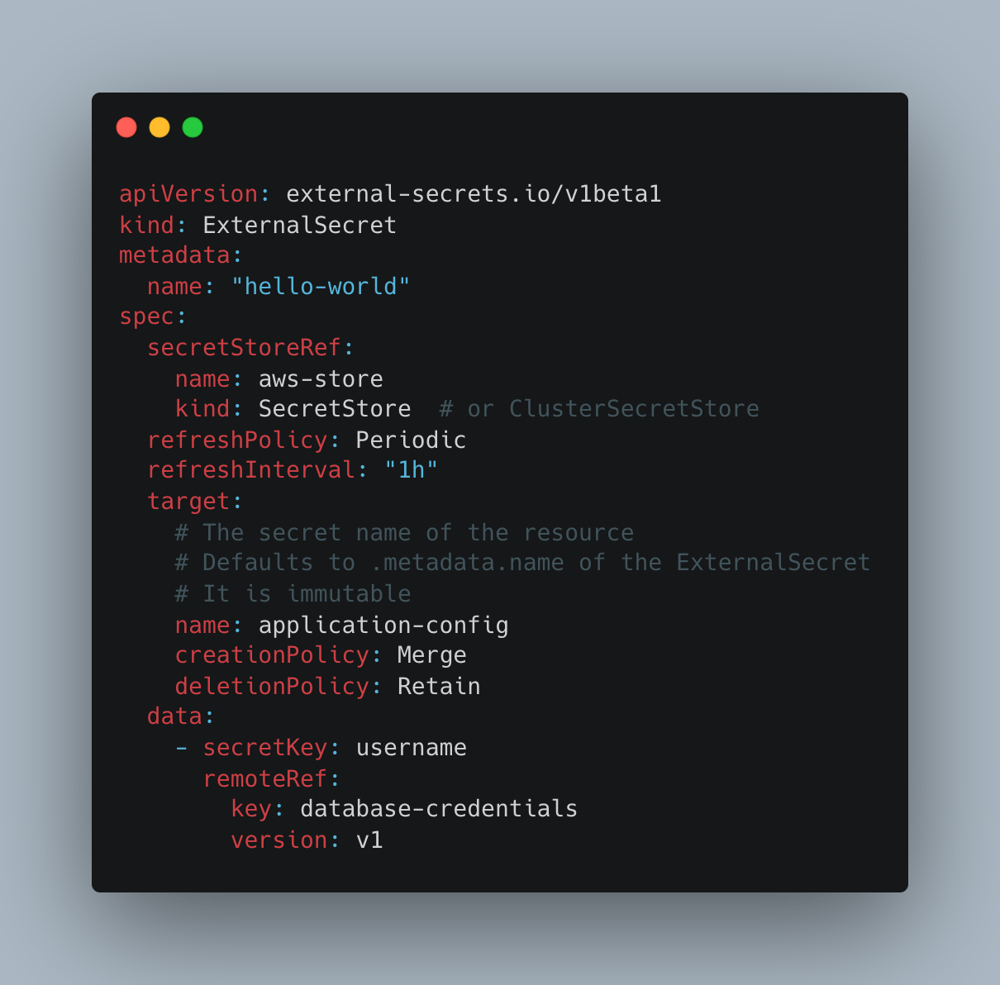
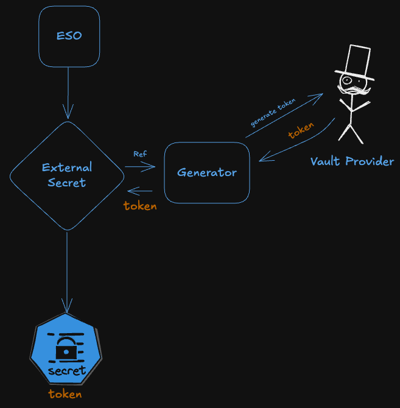
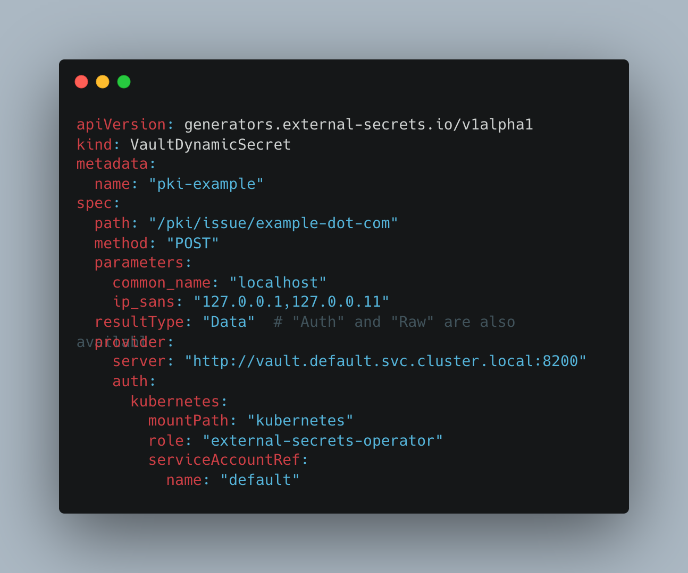

# Automatic Secret rotation with ESO

Gergely Brautigam 

https://github.com/Skarlso
https://gergelybrautigam.com 
https://github.com/external-secrets

---

# Agenda

- External Secrets intro
- Rotation
- ESO Reloader
- Demo
- Caveats
    - Downtime
    - Race conditions
- Closing words

---

# What is External Secrets Operator

<!--  -->

---

# Architecture

---

# Providers

- AWS
- GCP
- Vault
- Kubernetes
...

---

# SecretStore architecture

---

# SecretStore

---

# ExternalSecret

---

# What are generators

---

# Vault Dynamic Secret Generator

---

# Demo

---

# Conclusion

Thank you for listening!
Gergely.
@Skarlso
